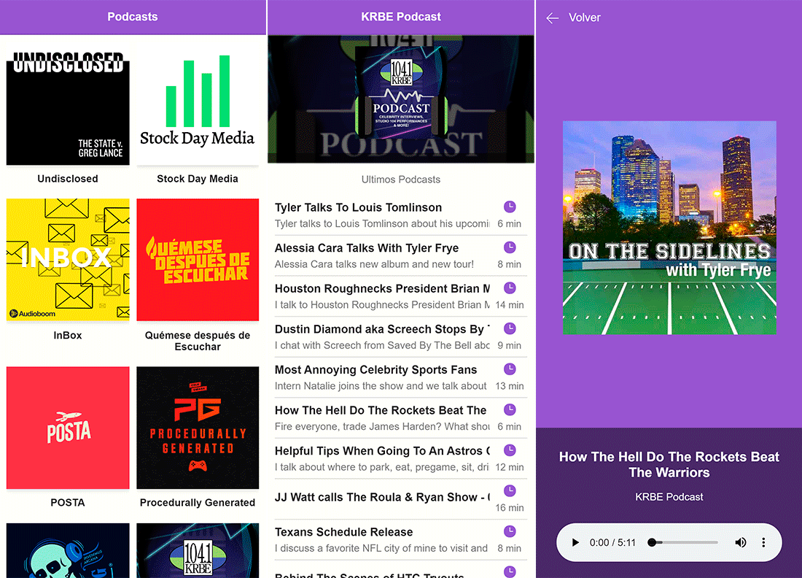

# Podcasts app with Nextjs

App with react, react-dom, next.js and AudioBoom API

## How does it work?

Requires Node.Js 13.6.0

- `npm install` to install the dependencies
- `npm run dev` for development environment
- `npm run build && npm start` for production environment

## License

MIT
